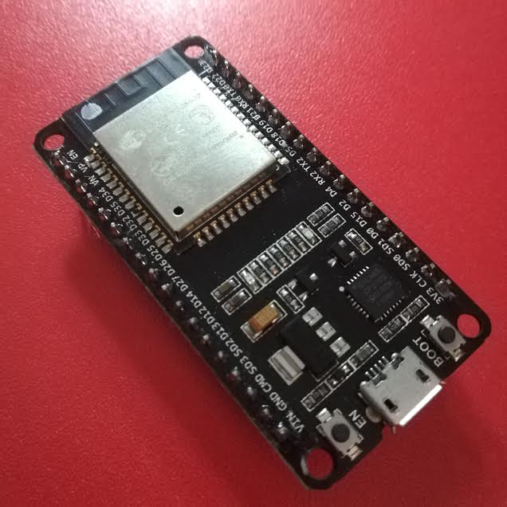

# TensorFlow LITE ESP32 ARDUINO

  
In this example i am testing my [__tensorFlow LITE__](https://github.com/sandroormeno/share_aws/blob/master/hello_world.zip?raw=true)  library with IRIS dataset. I used Arduino 1.6.9 but it works with the last vertion as well.   
The Model was trained in [__CoLab__](https://github.com/sandroormeno/TensorFlow-LITE-ESP32-ARDUINO/blob/master/tutorial.ipynb) and it has saved in Hexadecimal to  moved into __Arduino__   
The data were divided in 80% for training am 20% for testing, these last were used in arduino.  
Pay attention of the version tensorFlow for experience success.
```python
print("TensorFlow version: {}".format(tf.__version__))
```
```sh
TensorFlow version: 2.1.0
```
Those are the results:  
``` text

|-----------------------TensorFlowLite-ESP32-----------------------|
|---------------------------IRIS DATA SET--------------------------|
|-----------Prediction-ESP32----------|---------Real label---------|
|   0.00000     0.00600     0.12221   |    0.00    0.00    1.00    |
|   0.00000     0.00587     0.09518   |    0.00    0.00    1.00    |
|   0.00000     0.19259     0.00001   |    0.00    1.00    0.00    |
|   0.89623     0.00001     0.00000   |    1.00    0.00    0.00    |
|   0.00000     0.00443     0.61320   |    0.00    0.00    1.00    |
|   0.00000     0.05648     0.00009   |    0.00    1.00    0.00    |
|   0.93827     0.00000     0.00000   |    1.00    0.00    0.00    |
|   0.00000     0.00712     0.20495   |    0.00    0.00    1.00    |
|   0.91537     0.00000     0.00000   |    1.00    0.00    0.00    |
|   0.00001     0.21675     0.00001   |    0.00    1.00    0.00    |
|   0.00000     0.06905     0.00034   |    0.00    1.00    0.00    |
|   0.87214     0.00001     0.00000   |    1.00    0.00    0.00    |
|   0.00000     0.00268     0.63114   |    0.00    0.00    1.00    |
|   0.94849     0.00000     0.00000   |    1.00    0.00    0.00    |
|   0.95778     0.00000     0.00000   |    1.00    0.00    0.00    |
|   0.00000     0.02059     0.01378   |    0.00    0.00    1.00    |
|   0.00000     0.08299     0.00005   |    0.00    1.00    0.00    |
|   0.00000     0.04785     0.00096   |    0.00    1.00    0.00    |
|   0.00000     0.00182     0.61444   |    0.00    0.00    1.00    |
|   0.94879     0.00000     0.00000   |    1.00    0.00    0.00    |
|   0.00000     0.00334     0.63121   |    0.00    0.00    1.00    |
|   0.90084     0.00001     0.00000   |    1.00    0.00    0.00    |
|   0.94844     0.00000     0.00000   |    1.00    0.00    0.00    |
|   0.93505     0.00000     0.00000   |    1.00    0.00    0.00    |
|   0.00000     0.00195     0.63011   |    0.00    0.00    1.00    |
|   0.94440     0.00000     0.00000   |    1.00    0.00    0.00    |
|   0.73519     0.00001     0.00000   |    1.00    0.00    0.00    |
|   0.00000     0.01586     0.03025   |    0.00    0.00    1.00    |
|   0.00000     0.11228     0.00001   |    0.00    1.00    0.00    |
|   0.00000     0.16335     0.00005   |    0.00    1.00    0.00    |
|-------------------------------------|----------------------------|
```  
